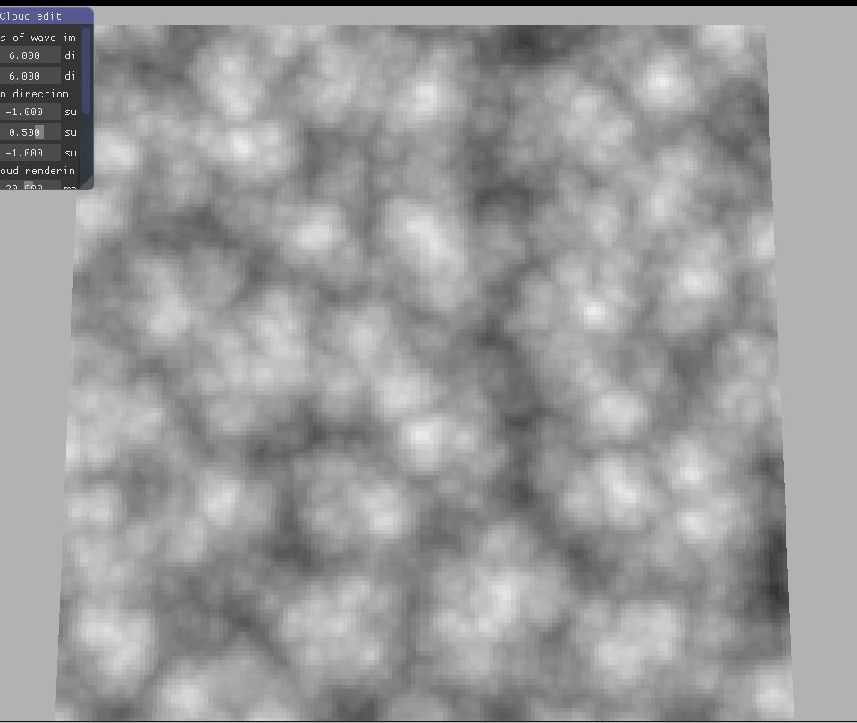

# Acloud

### Cloud rendering in D3D12 

### currently under development!

#### Features by now:

- raymarching into volume of 3d noise data
- inside each of the previous raymach iteration, using newly acquired sample position as new origin, do another raymarch toward sun for selfshadow approximation
- multi-layer perlin noise with worley noise
- level of detail noise
- compute shader generated P-W noise for approaching realistic coud shadpes:

- current raymarching effect

